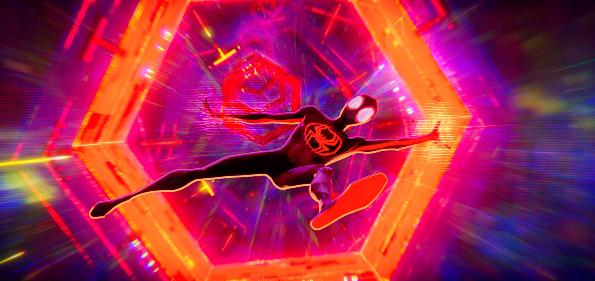
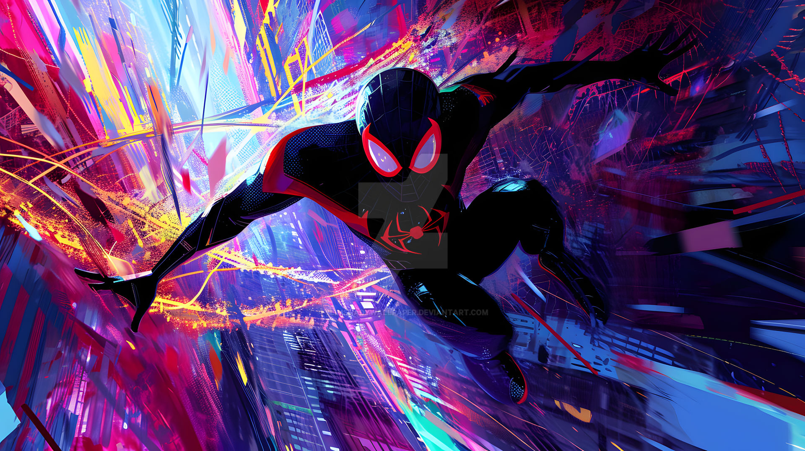
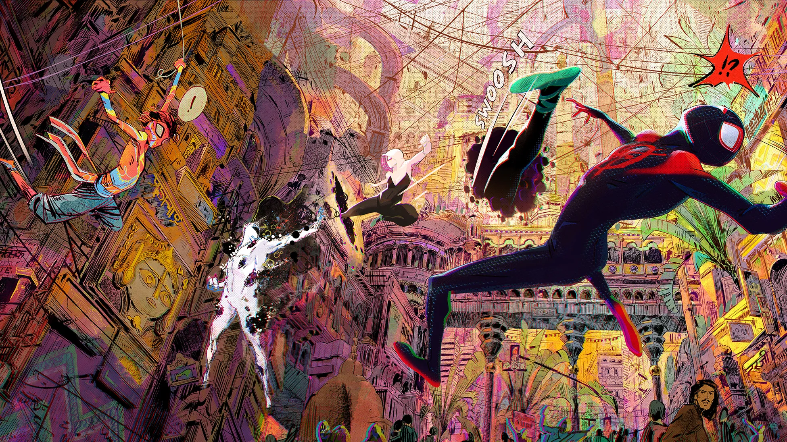
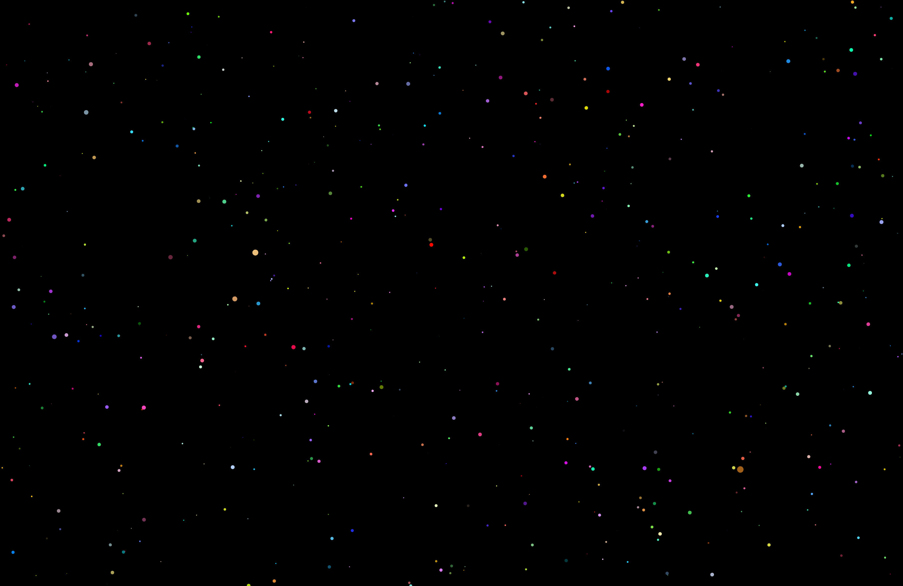
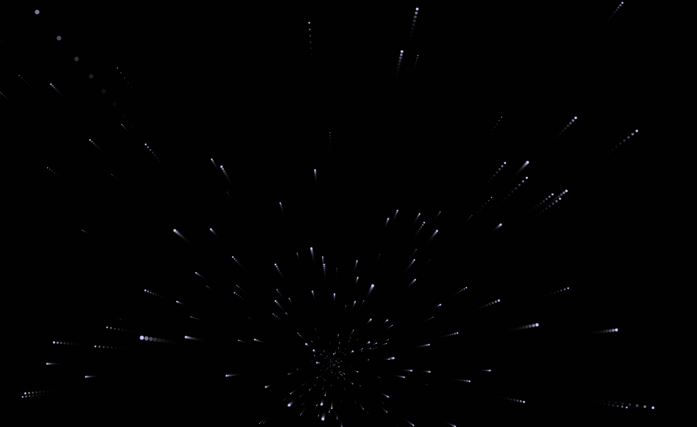

# xiyu0397_9103_tut06
# Quiz8

**Part 1: Imaging Technique Inspiration**

I was inspired by the animated film ‘Spider-Man, Across the Spider’, which is one of my personal favourite films. In this film, I can feel the intertwining of different artists' styles. For example, cyberpunk, watercolour, and ink styles are all represented in the film, and even each Spider-Man in the parallel universe has a different drawing style. Similarly, the use of colours in the film is also brilliant.
In my work, I want to show different styles and intertwine them, and then add some interactive elements and jumping colours.

*Spider-man in a time machine*

*Spider-Man jumps around the city*

*Spider-Man in different universes*

**Part 2: Coding Technique Exploration**

In the first set of code-generated screens below, I chose to apply a travelling shuttle sense. There are many colourful planets in the code, and after a mouse click, the planets with the sense of travelling become spinning forward. I wanted to use these elements in my code to create the first moment (or player view) of Spider-Man travelling between buildings.

*code1*

[Link Text](https://cassiofb-dev.github.io/star-field/)

In the second code below, not only is there a sense of travelling, but the mouse also controls the perspective, which is the element I want to add.

*code2*

[Link Text](https://htmlpreview.github.io/?https://github.com/QTimort/3d-starfield/blob/master/dist/index.html)
